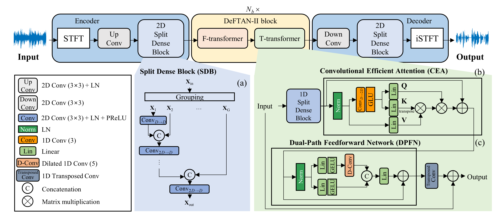
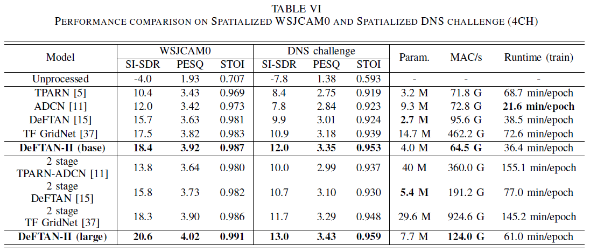
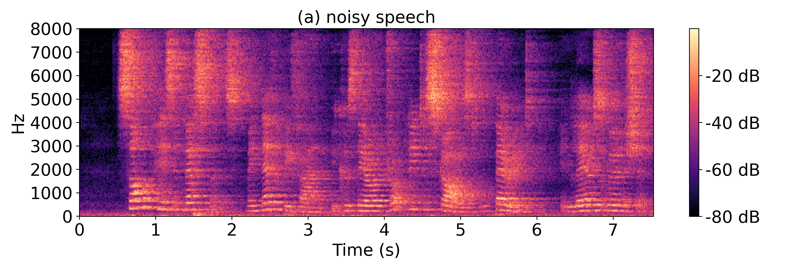
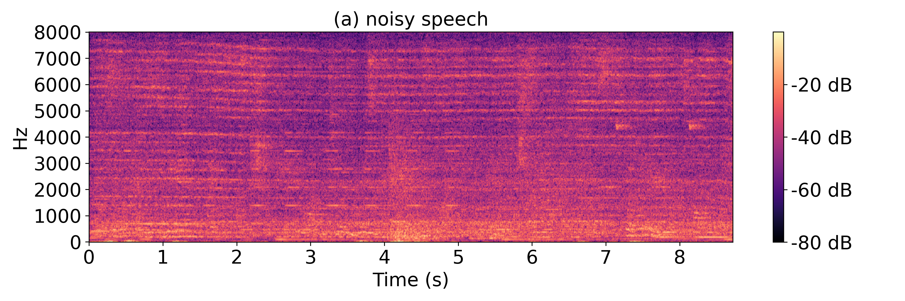

# DeFTAN-II


[](https://arxiv.org/pdf/2308.15777)
[](https://huggingface.co/donghoney0416/DeFTAN-II)

Official implementation of IEEE/ACM Transactions on Audio, Speech, and Language Processing (IEEE/ACM TASLP) 2024 paper **"[DeFTAN-II: Efficient multichannel speech enhancement with subgroup processing](https://arxiv.org/pdf/2308.15777) (accepted)"**.



## 1. Setup
1. Clone repository
```
git clone https://github.com/donghoney0416/DeFTAN-II.git
cd DeFTAN-II
```

2. Install requirements
```
pip install -r requirements.txt
```

# 2. Details
## Dataset
The dataset was simulated using pyroomacoustics. See `generate_rir/gen_rir.py` for an example of the code to run the simulation, and `generate_rir/pyroom_rir.cfg` for the configuration.

## Model
We released the code so that the model can be trained from scratch, and uploaded a pre-trained model trained on the spatialized dns challenge dataset to Hugging Face. 
See `DeFTAN2.py` and adjust the parameters, or change the modules inside to learn.

## Loss
The model was trained using PCM loss and SI-SDR loss, and PCM loss was uploaded. See `pcm_loss.py` and you can change it if you want.

## Using pre-traind model [](https://huggingface.co/donghoney0416/DeFTAN-II)
We have uploaded the pre-train model and how to use it to Hugging Pace. Thank you for checking it out and using it.

# Results
<details>
<br>
<summary><strong>Overall architecture</strong> (click to expand) </summary>

</details>
<br>

<details>
<br>
<summary><strong>Example of spatialized WSJCAM0 dataset</strong> (click to expand) </summary>

</details>
<br>

<details>
<br>
<summary><strong>Example of spatialized DNS challenge dataset</strong> (click to expand) </summary>

</details>
<br>

# Citations
```
@article{lee2024deftan,
  title={DeFTAN-II: Efficient multichannel speech enhancement with subgroup processing},
  author={Lee, Dongheon and Choi, Jung-Woo},
  journal={IEEE/ACM Transactions on Audio, Speech, and Language Processing},
  year={2024},
  publisher={IEEE}
}
```
